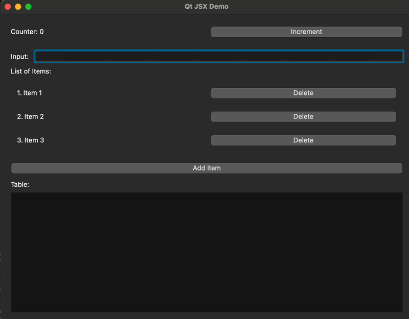

# node-qt-jsx

A Node.js binding for Qt with JSX support, allowing you to create native desktop applications using Node.js and Qt.

## About

This project was created through vibe coding so if you have bias against that, I would recommend you stop here.

## Features

- Native Qt bindings for Node.js
- JSX support for declarative UI creation
- Reactive list components
- Support for common Qt widgets (QWidget, QLabel, QLineEdit, QPushButton, etc.)
- Layout management (QVBoxLayout, QHBoxLayout)

## Prerequisites

- Node.js (v14 or higher)
- Qt development libraries
- node-gyp (for building native modules)

## Installation

```bash
npm install node-qt-jsx
```

## Quick Start

```typescript
import { QApplication, QWidget, QVBoxLayout, QLabel, QPushButton } from 'node-qt-jsx';

const app = new QApplication();
const window = new QWidget();
const layout = new QVBoxLayout();

const label = new QLabel("Hello, Qt!");
const button = new QPushButton("Click me!");

layout.addWidget(label);
layout.addWidget(button);
window.setLayout(layout);
window.show();

app.exec();
```

## JSX Demo Application

Here's a more comprehensive demo showcasing various features including reactive state management, list components, and layouts:

```typescript
import { computed, createSignal, getValue } from "node-qt-jsx";
import { createElement } from "node-qt-jsx";
import QApplication from "node-qt-jsx/components/QApplication";
import QMainWindow from "node-qt-jsx/components/QMainWindow";
import QVBoxLayout from "node-qt-jsx/components/QVBoxLayout";
import QHBoxLayout from "node-qt-jsx/components/QHBoxLayout";
import QPushButton from "node-qt-jsx/components/QPushButton";
import QLineEdit from "node-qt-jsx/components/QLineEdit";
import QLabel from "node-qt-jsx/components/QLabel";
import QListWidget from "node-qt-jsx/components/QListWidget";
import QTableWidget from "node-qt-jsx/components/QTableWidget";
import { render } from "node-qt-jsx/renderer";
import { reactiveList } from "node-qt-jsx/reactive-list";
import { randomUUID } from "crypto";

// Create some signals for state management
const counter = createSignal(0);
const inputText = createSignal("");
const items = reactiveList([
  { id: "1", name: "Item 1" },
  { id: "2", name: "Item 2" },
  { id: "3", name: "Item 3" },
]);

// Create a template function for the list
function ItemTemplate({ item, index }: { item: any; index: number }) {
  return (
    <QHBoxLayout>
      <QLabel text={`${index + 1}. ${item.name}`} />
      <QPushButton
        text="Delete"
        onClick={() => {
          items.remove(item);
        }}
      />
    </QHBoxLayout>
  );
}

// Main app
function App() {
  return (
    <QApplication>
      <QMainWindow title="Qt JSX Demo" width={800} height={600}>
        <QVBoxLayout>
          <QHBoxLayout>
            <QLabel text={computed(() => "Counter: " + counter.get())} />
            <QPushButton
              text="Increment"
              onClick={() => counter.set(counter.get() + 1)}
            />
          </QHBoxLayout>

          <QHBoxLayout>
            <QLabel text="Input: " />
            <QLineEdit
              text={getValue(inputText)}
              onChange={(text: string) => inputText.set(text)}
            />
          </QHBoxLayout>

          <QLabel text="List of Items:" />
          <QListWidget items={items}>{ItemTemplate}</QListWidget>
          <QPushButton
            text="Add Item"
            onClick={() =>
              items.insert({
                id: randomUUID().toString(),
                name: inputText.get(),
              })
            }
          />
          <QLabel text="Table:" />
          <QTableWidget />
        </QVBoxLayout>
      </QMainWindow>
    </QApplication>
  );
}

// Render the app
render(<App />);
```

Watch the demo in action:


## Building from Source

```bash
git clone https://github.com/yourusername/node-qt-jsx.git
cd node-qt-jsx
npm install
npm run build
```

## Contributing

Contributions are welcome! Please feel free to submit a Pull Request.

## License

This project is licensed under the MIT License - see the [LICENSE.md](LICENSE.md) file for details. 